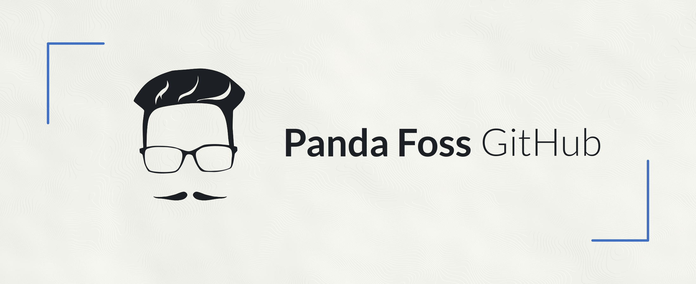

</img>

</img>

### Hola! 👋

Mi nombre es Max, soy developer autodidacta, intento de SysAdmin y estudiante de Ingeniería en Computación. Me apasiona el universo del software libre y de código abierto, crear y aportar en proyectos que sean útiles para la comunidad.

Además...

- 🧠 Me gusta aprender nuevos lenguajes de programación, generalmente para scripting (como Bash o Perl) o herramientas CLI (como Rust)
- 🐧 Entusiasta de Linux y usuario de Arch Linux
- 🗣 Me motiva compartir conocimiento (tengo un canal en [Telegram](https://t.me/ElBlogDelPanda) y una página en [Instagram](https://www.instagram.com/pandafossblog/) para tal fin)
- 💻 Soy mantenedor de [Anarchy Installer](https://anarchyinstaller.org/), un instalador TUI de Arch Linux
- ⚡️ Fun facts: me encantan los gatos 🐈, el mate 🧉 y mi pareja 👩🏼, por supuesto (?)

___

___

</img>

<a href="https://github.com/PandaFoss">
  </img>
</a>
<a href="https://gitlab.com/PandaFoss">
  </img>
</a>
<a href="https://www.instagram.com/pandafossblog/">
  </img>
</a>
<a href="https://t.me/ElBlogDelPanda">
  </img>
</a>
<a href="https://twitter.com/PandaFoss">
  </img>
</a>
<a href="https://pandafoss.github.io">
  </img>
</a>
<a href="mailto:maxi.fg13@gmail.com">
  </img>
</a>

___

</img>

<a href="https://liberapay.com/PandaFoss/donate">
  </img>
</a>
<a href="https://cafecito.app/pandafoss">
  </img>
</a>

