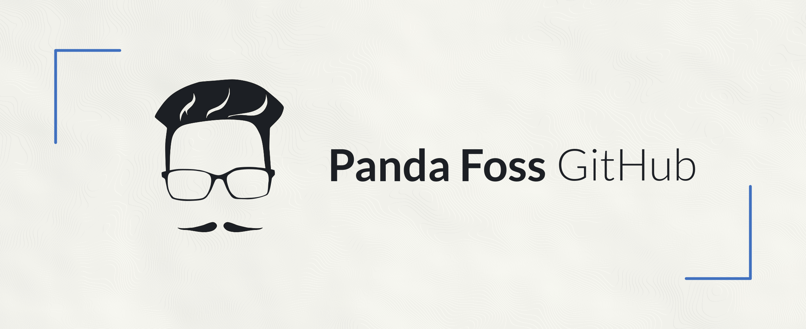

</img>

</img>

[🇪🇸 Leer en español](README.md)

### Hi! 👋

My name is Max, I'm a Cloud Engineer, a self-taught developer and a Computer Engineering student. I've been using GNU/Linux on a daily basis for almost half of my life. I'm passionate about the universe of free and open source software, creating and contributing to projects that are useful for the community.

Additionally...

- 🧠 I like to learn in a self-taught way and collaborate in open source projects
- 🐧 Linux enthusiast and Arch Linux user
- 🗣 I am motivated to share knowledge (I have a channel on [Telegram](https://t.me/ElBlogDelPanda) and a page on [Instagram](https://www.instagram.com/pandafossblog/) for that purpose)
- 💻 I am a maintainer of [Anarchy Installer](https://anarchyinstaller.org/), an Arch Linux TUI installer written in Bash.
- ⚡️ Fun facts: I love cats 🐈, drink mate 🧉 and my girlfriend 👩🏼, of course (?).

___

### Posts

**Info:** The blog articles are (probably) exclusively in Spanish. You can see the most recent ones [here](https://github.com/PandaFoss#art%C3%ADculos).
___

___

</img>

<a href="https://github.com/PandaFoss">
  </img>
</a>
<a href="https://gitlab.com/PandaFoss">
  </img>
</a>
<a href="https://www.instagram.com/pandafossblog/">
  </img>
</a>
<a href="https://t.me/ElBlogDelPanda">
  </img>
</a>
<a href="https://dev.to/pandafoss">
  </img>
</a>
<a href="https://twitter.com/PandaFoss">
  </img>
</a>
<a href="https://pandafoss.github.io">
  </img>
</a>
<a href="mailto:maxi.fg13@gmail.com">
  </img>
</a>

___

</img>

<a href="https://liberapay.com/PandaFoss/donate">
  </img>
</a>
<a href="https://cafecito.app/pandafoss">
  </img>
</a>

